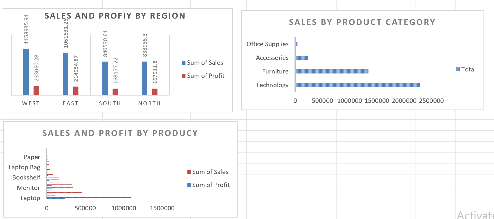
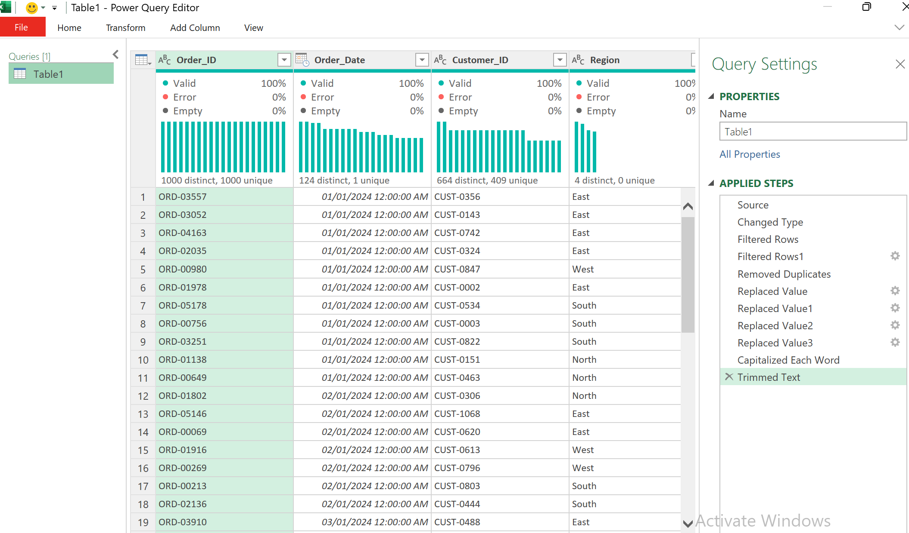
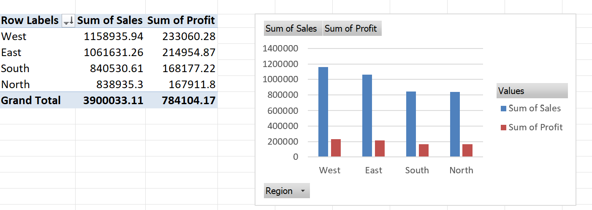

# Sales & Profit Performance Analysis

## 📊 Project Overview

This project analyzes sales and profit performance using Microsoft Excel and Power Query.

The objective is to transform raw sales data into meaningful business insights and create an interactive dashboard to support data-driven decision-making.

## 🎯 Project Objectives

- Analyze overall sales and profit performance
- Compare performance across regions
- Analyze sales by product category
- Identify high-performing products
- Calculate and evaluate key performance indicators
- Create a clear and professional dashboard

## 🛠️ Tools & Technologies

- Microsoft Excel
- Power Query
- Pivot Tables
- Pivot Charts
- Excel Dashboard
- Data Cleaning & Transformation

## 🧹 Data Cleaning & Transformation

The raw dataset was prepared and transformed using Power Query.

The main steps included:

- Reviewing the dataset structure
- Checking data quality
- Handling data types
- Standardizing categorical values
- Preparing numerical fields for analysis
- Transforming the data into an analysis-ready format

## 📈 Analysis & Dashboard

An Excel dashboard was created to visualize sales and profit performance.

The dashboard includes:

- Sales and profit by region
- Sales by product category
- Sales and profit by product
- Key performance indicators
- Visual comparisons to identify performance differences

## 🔍 Key Insights

- The West region generated the highest sales performance.
- The East region was also one of the strongest-performing regions.
- Technology products generated the highest sales among the analyzed product categories.
- Regional performance showed differences in both sales and profit.
- The dashboard makes it easier to identify high-performing areas and products.

## 💡 Business Recommendations

Based on the analysis:

- Continue focusing on high-performing product categories.
- Investigate the factors driving strong performance in the leading regions.
- Review lower-performing regions and products to identify improvement opportunities.
- Use sales and profit KPIs regularly to support business decisions.
- Monitor product and regional performance over time.
## 📸 Project Screenshots

### Dashboard

### Power Query Data Cleaning

### Pivot Table – Sales & Profit

## 📁 Project File

The repository contains the final Excel analysis file:

[Project Excel File](./Project_1%20FIRST%20PROJECT_Sales_Performance_Final.xlsx)

## 👩‍💻 Author

Latifa

Aspiring Data Analyst
